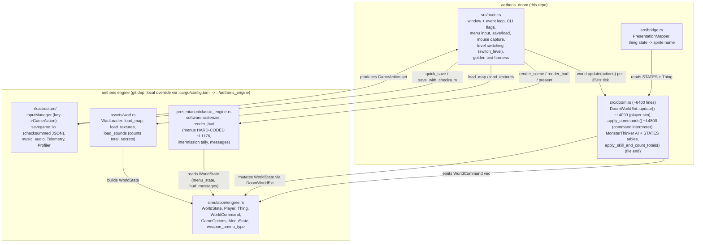
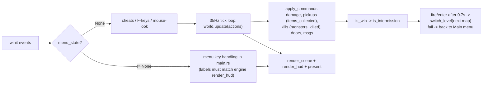

# Aetheris DOOM — Architecture Map

Bootstrap notes for future work sessions (human or agent). Diagrams are Mermaid;
GitHub and most IDEs render them inline. Verified against the code on 2026-07-02.

## Crate & module graph

## Runtime flow (one frame)

## Load-bearing constraints (learned the hard way)

- **Menus are rendered by the engine** with hard-coded titles/labels/counts
  (`classic_engine.rs` `render_hud`). Game-side handlers in `main.rs` must match:
  Main=4, Episode=1, Difficulty=5, Options=2 ("Sound","Video"), Save/Load=6 slots.
- Engine honors `options.sfx_volume`, `options.music_volume`, `player.fov`;
  it **ignores** `gamma`, `screen_size`, `show_fps` (gamma hard-coded 1.2).
- Saves are `WorldState` JSON only — **no map name** (`save_with_checksum` has a
  `TODO`), so episode/map progression counters can't be restored on load.
- `.cargo/config.toml` (gitignored) path-overrides the git dep to `../aetheris_engine`;
  local engine edits don't reach users unless pushed to the engine repo.
- Skill filtering uses WAD thing flags (0x1 easy / 0x2 medium / 0x4 hard,
  0x10 = multiplayer-only) via `doom::apply_skill_and_count_totals`, called on
  every level (re)load in `main.rs::switch_level`.
- `--golden-test` / `--update-goldens` skip the boot menu and drive fixed camera
  shots; no baselines are committed, CI doesn't run them.

## Deferred work (pick up when budget allows)

1. **Engine:** add map name to `WorldState`/save format (fixes progression-after-load);
   move menu labels out of `render_hud` so the game owns its menus.
2. Secret exits (linedef special 52) → E1M9; currently progression is linear.
3. Clippy: many warnings, CI non-blocking; dead-code sweep in `doom.rs` constants.
4. DEHACKED patch is parsed but never applied.
5. Vertical mouse aim / weapon-bob polish; menu navigation sounds (needs audio
   update while menu open — sim tick is skipped when a menu is up).
